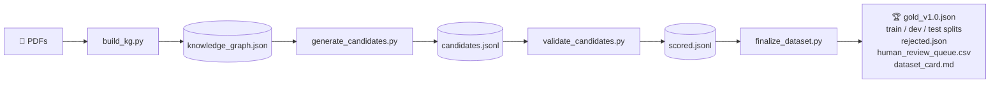

# 🔍 Gold-Standard RAG Evaluation Dataset Pipeline

> A file-based, crash-resumable pipeline for building high-quality RAG evaluation datasets from PDF documents in the **AUTOSAR** domain.


---

## Overview

This project implements a three-stage QA dataset generation workflow:

1. **Build a knowledge graph** from source PDFs
2. **Generate candidate question–answer pairs** from the graph
3. **Validate, filter, and finalize** the gold dataset

Each stage reads from disk and writes to disk, so the pipeline is fully resumable, re-runnable with different thresholds, and auditable — without repeating earlier LLM work.

---

## ✨ Highlights

- Designed for **open-weight vLLM models**
- Built around a **local vLLM server** workflow
- Supports **append-only JSONL** and **atomic JSON writes** for safe reruns
- Uses **separate generator and judge models** so only one large model is in memory at a time
- Includes **rule-based quality checks** to reject noisy, weakly grounded, or low-value samples
- Produces a final dataset with **train/dev/test splits**, a **rejection log**, a **human review queue**, and a **dataset card**

---

## Pipeline



### Output layout

```
output/
├── kg/
│   └── knowledge_graph.json
├── stage_a_generation/
│   └── candidates.jsonl
├── stage_b_validation/
│   └── scored.jsonl
└── stage_c_finalization/
    ├── gold_v1.0.json
    ├── gold_v1.0_train.json
    ├── gold_v1.0_dev.json
    ├── gold_v1.0_test.json
    ├── rejected.json
    ├── human_review_queue.csv
    ├── dataset_card.md
    └── summary.json
```

---

## Repository structure

```
Data_generation/
├── build_kg.py
├── generate_candidates.py
├── validate_candidates.py
├── finalize_dataset.py
├── clean_GT.py
├── check_dataset_quality.py
├── requirements.txt
└── shared/
    ├── io_utils.py
    ├── llm_batch.py
    ├── personas.py
    ├── prompts.py
    ├── schemas.py
    ├── validators.py
    └── __init__.py
```

---

## Requirements

### Software

| Requirement | Version |
|-------------|---------|
| Python | 3.10+ |
| pip | latest |
| vLLM | working local setup |

### Hardware

Scripts were designed for **2 × 48 GB GPUs** with a single-model-at-a-time workflow.

---

## Installation

```bash
python -m venv .venv
source .venv/bin/activate
pip install -r requirements.txt
```

---

## End-to-end workflow

### Step 1 — Build the knowledge graph

Loads PDFs, removes boilerplate, filters low-value pages, and builds the knowledge graph.

**Start the vLLM server:**

```bash
vllm serve Qwen/Qwen2.5-72B-Instruct-AWQ \
    --tensor-parallel-size 2 \
    --max-model-len 8192 \
    --gpu-memory-utilization 0.90 \
    --quantization awq \
    --port 8011
```

**Run the graph builder:**

```bash
python build_kg.py \
    --pdf-dir ./pdfs \
    --output-dir ./output
```

Output: `output/kg/knowledge_graph.json`

> Once built, the knowledge graph can be reused across multiple generation runs. Existing outputs are preserved unless you pass `--force`.

---

### Step 2 — Generate candidate QA pairs

Over-generates candidate samples using multiple synthesizer types and personas for diversity.

```bash
python generate_candidates.py \
    --kg-file ./output/kg/knowledge_graph.json \
    --output-dir ./output \
    --target 500
```

**Synthesis styles:**

| Style | Description |
|-------|-------------|
| `single_hop_specific` | Concrete question from a single node |
| `single_hop_abstract` | Abstract/conceptual question from a single node |
| `multi_hop_specific` | Concrete question requiring multiple nodes |
| `multi_hop_abstract` | Abstract reasoning across multiple nodes |

Output: `output/stage_a_generation/candidates.jsonl` (append-only — safe to interrupt and resume)

---

### Step 3 — Validate candidates

Scores each candidate using a separate judge model and rule-based checks.

```bash
python validate_candidates.py --output-dir ./output
```

**Judge scoring criteria:**

| Criterion | Description |
|-----------|-------------|
| Answerability | Can the question be answered from the provided contexts? |
| Faithfulness | Is the answer fully supported by the contexts? |
| Answer relevance | Does the answer actually address the question? |
| Question specificity | Is the question self-contained and useful? |

**Structural checks also flag:**
- Noisy or informal queries
- TOC-only or index-like contexts
- Boilerplate-only contexts
- Mismatched synthesizer/context counts
- Duplicate or echo-style samples
- Vague references

Output: `output/stage_b_validation/scored.jsonl`

---

### Step 4 — Finalize the gold dataset

Pure filtering and splitting — no model is loaded.

```bash
python finalize_dataset.py --output-dir ./output --target 500
```

**Default thresholds:**

| Metric | Threshold |
|--------|-----------|
| `answerability` | == 1 |
| `question_specificity` | == 1 |
| `faithfulness` | >= 0.85 |
| `answer_relevance` | >= 0.80 |
| Structural failures | 0 |

**What it produces:**
- Filtered and deduplicated gold samples
- Source-document diversity enforcement
- Train / dev / test splits
- Rejection log and human review queue

---

## Data schema

### Candidate fields (after stage 2)

| Field | Description |
|-------|-------------|
| `candidate_id` | Unique identifier |
| `user_input` | The question |
| `reference` | The gold answer |
| `reference_contexts` | Source passages |
| `synthesizer_name` | Generation style used |
| `persona_name` | Persona applied |
| `source_node_ids` | KG nodes used |
| `source_documents` | Source PDF filenames |
| `generator_model` | Model that produced the sample |
| `generator_config` | Generation hyperparameters |
| `generated_at` | Timestamp |

### Additional fields after validation (stage 3)

| Field | Description |
|-------|-------------|
| `scores` | Per-criterion judge scores |
| `judge_rationales` | Judge explanations |
| `judge_model` | Model used for judging |
| `scored_at` | Timestamp |

---

## CLI reference

<details>
<summary><code>build_kg.py</code></summary>

| Argument | Description |
|----------|-------------|
| `--pdf-dir` | Directory containing source PDFs |
| `--output-dir` | Base output directory |
| `--llm-model` | Generator model name |
| `--embed-model` | Embedding model name |
| `--vllm-url` | Local vLLM endpoint |
| `--max-workers` | Parallelism for transforms |
| `--force` | Rebuild even if graph exists |
| `--fresh` | Discard checkpoints and restart |

</details>

<details>
<summary><code>generate_candidates.py</code></summary>

| Argument | Description |
|----------|-------------|
| `--kg-file` | Input knowledge graph JSON |
| `--output-dir` | Base output directory |
| `--target` | Desired final dataset size |
| `--overgen-ratio` | Over-generation factor (single-hop) |
| `--overgen-ratio-multihop` | Over-generation factor (multi-hop) |
| `--generator-model` | Candidate generation model |
| `--vllm-url` | Local vLLM endpoint |
| `--batch-size` | Batch size for inference |
| `--q-temperature` | Question generation temperature |
| `--a-temperature` | Answer generation temperature |
| `--seed` | Random seed |
| `--min-context-chars` | Minimum context length |
| `--min-per-pdf` | Minimum sampled scenarios per PDF |

</details>

<details>
<summary><code>validate_candidates.py</code></summary>

| Argument | Description |
|----------|-------------|
| `--output-dir` | Base output directory |
| `--judge-model` | Judge model name |
| `--vllm-url` | Local vLLM endpoint |
| `--batch-size` | Validation batch size |
| `--seed` | Random seed |

</details>

<details>
<summary><code>finalize_dataset.py</code></summary>

| Argument | Description |
|----------|-------------|
| `--output-dir` | Base output directory |
| `--target` | Final dataset size |
| `--version` | Dataset version string |
| `--min-faithfulness` | Faithfulness threshold |
| `--min-answer-relevance` | Answer relevance threshold |
| `--max-source-share` | Max fraction from one source document |
| `--train-frac` | Train split fraction |
| `--dev-frac` | Dev split fraction |
| `--human-review-frac` | Fraction reserved for SME review |
| `--seed` | Random seed |

</details>

---

## Data quality strategy

The pipeline applies a layered filtering approach:

1. **Context filtering** during KG construction removes weak pages and boilerplate
2. **Controlled generation** uses diverse personas and synthesizer types
3. **Judge validation** scores groundedness and usefulness
4. **Rule-based checks** reject obvious bad samples before they reach the gold set
5. **Final filtering and deduplication** keep the dataset balanced and diverse
6. **Human review queue** supports SME calibration before treating samples as gold

---

## Utility scripts

### `clean_GT.py`

Removes records from a ground-truth JSON file. Supports two modes:
- Remove records that failed retrieval evaluation
- Remove a random subset of records

Useful for preparing smaller evaluation subsets.

### `check_dataset_quality.py`

Inspects dataset properties such as context-count distribution.

---

## Reproducibility

Each stage can be rerun independently:

- Knowledge graph reused across generation runs
- Candidate generation appends only missing samples
- Validation skips already-scored candidates
- Finalization reruns with different thresholds without repeating any LLM calls

---

## Troubleshooting

**vLLM connection errors**

Check that the local server is running on the expected URL:
```
http://localhost:8011/v1
```

**GPU memory issues**

Reduce `--batch-size`, lower the model context length, or ensure only one model is loaded at a time.

**Too few samples in the final dataset**

Lower the thresholds or increase `--overgen-ratio`, then rerun finalization.

**Too many weak samples**

Raise `--min-faithfulness` and `--min-answer-relevance`, then rerun finalization.

---

## Notes

This repository is focused on **dataset creation**, not end-user question answering. The final artifacts are intended for RAG evaluation, calibration, and benchmarking.
