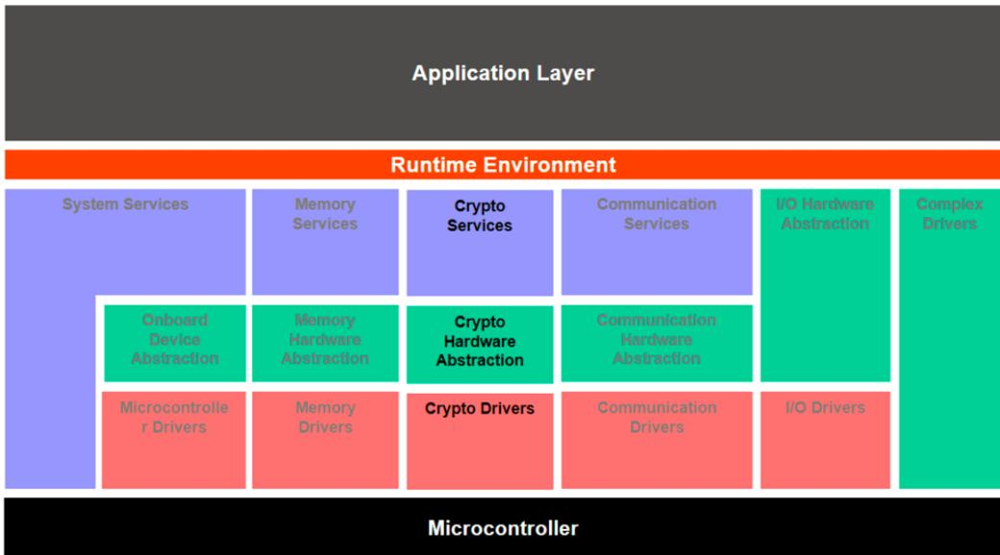

<table><tr><td rowspan=1 colspan=1>Document Title</td><td rowspan=1 colspan=1>Utilization of Crypto Services</td></tr><tr><td rowspan=1 colspan=1>Document Owner</td><td rowspan=1 colspan=1>AUTOSAR</td></tr><tr><td rowspan=1 colspan=1>Document Responsibility</td><td rowspan=1 colspan=1>AUTOSAR</td></tr><tr><td rowspan=1 colspan=1>Document ldentification No</td><td rowspan=1 colspan=1>602</td></tr></table>

<table><tr><td rowspan=1 colspan=1>Document Status</td><td rowspan=1 colspan=1>published</td></tr><tr><td rowspan=1 colspan=1>Part of AUTOSAR Standard</td><td rowspan=1 colspan=1>Classic Platform</td></tr><tr><td rowspan=1 colspan=1>Part of Standard Release</td><td rowspan=1 colspan=1>R25-11</td></tr></table>

<table><tr><td rowspan=1 colspan=4>Document Change History</td></tr><tr><td rowspan=1 colspan=1>Date</td><td rowspan=1 colspan=1> Release</td><td rowspan=1 colspan=1> Changed by</td><td rowspan=1 colspan=1>Description</td></tr><tr><td rowspan=1 colspan=1>2025-11-27</td><td rowspan=1 colspan=1>R25-11</td><td rowspan=1 colspan=1>AUTOSARReleaseManagement</td><td rowspan=1 colspan=1>· No content changes</td></tr><tr><td rowspan=1 colspan=1>2024-11-27</td><td rowspan=1 colspan=1>R24-11</td><td rowspan=1 colspan=1>AUTOSARReleaseManagement</td><td rowspan=1 colspan=1>·Editorial changes</td></tr><tr><td rowspan=1 colspan=1>2023-11-23</td><td rowspan=1 colspan=1>R23-11</td><td rowspan=1 colspan=1>AUTOSARReleaseManagement</td><td rowspan=1 colspan=1>· Editorial changes</td></tr><tr><td rowspan=1 colspan=1>2022-11-24</td><td rowspan=1 colspan=1>R22-11</td><td rowspan=1 colspan=1>AUTOSARReleaseManagement</td><td rowspan=1 colspan=1>·Bugfix done to ensure secure counterremoval</td></tr><tr><td rowspan=1 colspan=1>2021-11-25</td><td rowspan=1 colspan=1>R21-11</td><td rowspan=1 colspan=1>AUTOSARReleaseManagement</td><td rowspan=1 colspan=1>· No content changes</td></tr><tr><td rowspan=1 colspan=1>2020-11-30</td><td rowspan=1 colspan=1>R20-11</td><td rowspan=1 colspan=1>AUTOSARReleaseManagement</td><td rowspan=1 colspan=1>· No content changes</td></tr><tr><td rowspan=1 colspan=1>2019-11-28</td><td rowspan=1 colspan=1>R19-11</td><td rowspan=1 colspan=1>AUTOSARReleaseManagement</td><td rowspan=1 colspan=1>· No content changes·Changed Document Status from Final toPublished</td></tr><tr><td rowspan=1 colspan=1>2018-10-31</td><td rowspan=1 colspan=1>4.4.0</td><td rowspan=1 colspan=1>AUTOSARReleaseManagement</td><td rowspan=1 colspan=1>·Removed Crypto Abstraction Libraryreferences·Editorial changes</td></tr><tr><td rowspan=1 colspan=1>2017-12-08</td><td rowspan=1 colspan=1>4.3.1</td><td rowspan=1 colspan=1>AUTOSARReleaseManagement</td><td rowspan=1 colspan=1>· Editorial changes</td></tr></table>

△
<table><tr><td rowspan=1 colspan=1>2016-11-30</td><td rowspan=1 colspan=1>4.3.0</td><td rowspan=1 colspan=1>AUTOSARReleaseManagement</td><td rowspan=1 colspan=1>· Editorial changes</td></tr><tr><td rowspan=1 colspan=1>2015-07-31</td><td rowspan=1 colspan=1>4.2.2</td><td rowspan=1 colspan=1>AUTOSARReleaseManagement</td><td rowspan=1 colspan=1>·Editorial changes</td></tr><tr><td rowspan=1 colspan=1>2014-10-31</td><td rowspan=1 colspan=1>4.2.1</td><td rowspan=1 colspan=1>AUTOSARReleaseManagement</td><td rowspan=1 colspan=1>·Editorial changes</td></tr><tr><td rowspan=1 colspan=1>2013-03-15</td><td rowspan=1 colspan=1>4.1.1</td><td rowspan=1 colspan=1>AUTOSARAdministration</td><td rowspan=1 colspan=1>· Initial release</td></tr></table>

## Disclaimer

This work (specification and/or software implementation) and the material contained in it, as released by AUTOSAR, is for the purpose of information only. AUTOSAR and the companies that have contributed to it shall not be liable for any use of the work.

The material contained in this work is protected by copyright and other types of intellectual property rights. The commercial exploitation of the material contained in this work requires a license to such intellectual property rights.

This work may be utilized or reproduced without any modification, in any form or by any means, for informational purposes only. For any other purpose, no part of the work may be utilized or reproduced, in any form or by any means, without permission in writing from the publisher.

The work has been developed for automotive applications only. It has neither been developed, nor tested for non-automotive applications.

The word AUTOSAR and the AUTOSAR logo are registered trademarks.

## Table of Contents

1 Introduction 5   
1.1 Purpose of the Document 5   
1.2 Scope of the Document . 5   
1.3 Limitations 5   
2 Definition of terms and acronyms 6   
2.1 Acronyms and abbreviations 6   
2.2 Definition of terms . 6   
3 Related Documentation 7   
3.1 Input documents & related standards and norms . 7   
4 Crypto Stack Overview 8   
4.1 Stack Architecture 8   
4.2 The Crypto Service Manager (CSM) 9   
4.3 The Crypto Interface (CRYIF) 9   
4.4 The Crypto Driver (CRYPTO) 10   
5 Usage Aspects 11   
5.1 Job Concept 11   
5.1.1 Synchronous and Asynchronous Mode 11   
5.1.2 Queuing and Priorities 11   
5.1.3 Streaming Approach vs Single Call Approach. 12   
5.2 Key Handling 12   
5.3 Configuration Philosophy 13   
5.3.1 Registration of Crypto Functionality 13   
5.3.2 Project Configuration 13   
6 Example 14   
6.1 Configuration in Modules 14   
6.2 APIs involved 14

## 1 Introduction

## 1.1 Purpose of the Document

This document describes the intended usage of the AUTOSAR specified cryptographic functionality starting with AUTOSAR 4.3. The purpose of the document is to introduce the user/integrator to the principle concepts of the AUTOSAR supported cryptographic functionality.

## 1.2 Scope of the Document

The scope of this document is to help crypto stack integrators and users to understand:

• Architecture of AUTOSAR crypto stack;

• Integral representation of modules and their relationships;

• Integration of crypto hardware and software.

## 1.3 Limitations

No limitations

## 2 Definition of terms and acronyms

## 2.1 Acronyms and abbreviations

<table><tr><td rowspan=1 colspan=1>Abbreviation / Acronym:</td><td rowspan=1 colspan=1>Description:</td></tr><tr><td rowspan=1 colspan=1>BSW</td><td rowspan=1 colspan=1>Basic Software</td></tr><tr><td rowspan=1 colspan=1>CDD</td><td rowspan=1 colspan=1>Complex Device Driver</td></tr><tr><td rowspan=1 colspan=1>CRYIF</td><td rowspan=1 colspan=1>Crypto Interface</td></tr><tr><td rowspan=1 colspan=1>CRYPTO</td><td rowspan=1 colspan=1>Crypto Driver</td></tr><tr><td rowspan=1 colspan=1>CSM</td><td rowspan=1 colspan=1>Crypto Service Manager</td></tr><tr><td rowspan=1 colspan=1>HSM</td><td rowspan=1 colspan=1>Hardware Security Module</td></tr><tr><td rowspan=1 colspan=1>NvM</td><td rowspan=1 colspan=1>NVRAM Manager</td></tr><tr><td rowspan=1 colspan=1>RTE</td><td rowspan=1 colspan=1>Runtime Environment</td></tr><tr><td rowspan=1 colspan=1>SHE</td><td rowspan=1 colspan=1>Security Hardware Extension</td></tr><tr><td rowspan=1 colspan=1>SWC</td><td rowspan=1 colspan=1>Software Component</td></tr></table>

Table 2.1

## 2.2 Definition of terms

<table><tr><td rowspan=1 colspan=1>Terms:</td><td rowspan=1 colspan=1> Description:</td></tr><tr><td rowspan=1 colspan=1>Crypto Driver Object</td><td rowspan=1 colspan=1>A Crypto Driver implements one or more Crypto Driver Objects.The Crypto Driver Objectcan offer different crypto primitives in hardware or software.The Crypto Driver Objects ofone Crypto Driver are independent of each other. There is only one workspace for eachCrypto Driver Object (i.e. only one crypto primitive can be performed at the same time).</td></tr><tr><td rowspan=1 colspan=1>Crypto Primitive</td><td rowspan=1 colspan=1>A crypto primitive is an instance of a configured cryptographic algorithm realized in a CryptoDriver Object.</td></tr><tr><td rowspan=1 colspan=1>Job</td><td rowspan=1 colspan=1>A job is a configured crypto primitive together with a referenced key.</td></tr><tr><td rowspan=1 colspan=1>Key</td><td rowspan=1 colspan=1>A key can be referenced by a job or by a key management function in the CSM.In theCrypto Driver, the key refers a specific key type.</td></tr><tr><td rowspan=1 colspan=1>Key Element</td><td rowspan=1 colspan=1>Key elements are used to store data.This data can be,e.g., key material or the IV neededfor AES encryption. It can also be used to configure the behavior of the key managementfunctions.</td></tr><tr><td rowspan=1 colspan=1>Key Type</td><td rowspan=1 colspan=1>A key type consists of references to key elements.The key types are typicallypre-configured by the vendor of the Crypto Driver.</td></tr><tr><td rowspan=3 colspan=1>Processing</td><td rowspan=1 colspan=1>Indicates the kind of job processing.</td></tr><tr><td rowspan=1 colspan=1>The job is not processed immediately when calling acorresponding function. Usually, the caller is informed via acallback function when the job has been finished.</td></tr><tr><td rowspan=1 colspan=1>The job is processed immediately when calling acorresponding function.When the function returns,a resultwill be available.</td></tr></table>

Table 2.2

## 3 Related Documentation

## 3.1 Input documents & related standards and norms

[1] Specification of Crypto Service Manager AUTOSAR_CP_SWS_CryptoServiceManager

[2] Specification of Crypto Interface AUTOSAR_CP_SWS_CryptoInterface

[3] Specification of Crypto Driver AUTOSAR_CP_SWS_CryptoDriver

[4] Layered Software Architecture AUTOSAR_CP_EXP_LayeredSoftwareArchitecture

## 4 Crypto Stack Overview

Cryptographic services include, e.g., the computation of hashes, the verification of asymmetrical signatures, or the symmetrical encryption of data. In AUTOSAR, these services are supplied by the AUTOSAR crypto stack, namely the Crypto Service Manager (CSM) [1], the underlying Crypto Interface (CRYIF) [2], and Crypto Driver (CRYPTO) [3].

CSM services use cryptographic algorithms that are implemented using cryptographic software or hardware modules - both are out of scope and not specified by AUTOSAR. The hardware implementations heavily depend on the supported features of the target platform. Software implementations lack the support of e.g. secure key storage and have to rely on memory services provided by the AUTOSAR stack.

The AUTOSAR crypto stack does not provide a security concept. It offers cryptographic services that can be used to support and realize a certain security concept.

## 4.1 Stack Architecture

The AUTOSAR crypto stack expands over all layers of the AUTOSAR Layered Architecture [4]:

  
Figure 4.1: AUTOSAR layered view of the crypto stack [1]

• On the lowest level, the Microcontroller Abstraction Layer, the Crypto Drivers (CRYPTO) [3] are located. These modules hold the actual implementations of the different cryptographic hardware and software instances, e.g., an external HSM. A specific characteristic of the crypto stack is that there might be more than one Crypto Driver module;

• The CRYIF module is suited on the Hardware Abstraction Layer. It provides a generic interface for the CSM to the available Crypto Driver modules and makes the access independent of the underlying Crypto Drivers;

• The CSM is located on the Service Layer. It provides an abstraction layer, which offers standardized access to cryptographic services for applications via the RTE port mechanism. Other BSW modules and CDD can use C-API calls provided by the CSM to use the cryptographic services.

## 4.2 The Crypto Service Manager (CSM)

The CSM [1] controls the concurrent access of one or more clients to one or more synchronous/asynchronous cryptographic services. It offers prioritized queues to manage jobs that could not directly be processed by the dedicated CRYPTO. The functionality provided by the CSM covers the following areas:

• Hash calculation;

• Generation and verification of message authentication codes;

• Generation and verification of digital signature;

• Encryption and decryption using symmetrical or asymmetrical algorithms;

• Random number generation;

• Key management operations, e.g., key setting and generation.

The CSM services are generic and the CSM allows different applications to use the same service with different cryptographic algorithms. This is feasible due to the possibility to configure and initialize the services individually. For example, one application might need the hash service to compute a SHA-2 digest and another application to compute a SHA-3 digest.

The actual cryptographic routines are encapsulated by the CSM. The service client does not need to care about, if the routine is implemented in software or hardware, or which CRYPTO module actually maintains the requested cryptographic routine. The CSM provides an abstraction layer to all cryptographic features available in the crypto stack.

## 4.3 The Crypto Interface (CRYIF)

The CRYIF [2] is enclosed by the upper layer CSM and by the lower layer CRYPTO. It receives requests from the CSM and maps them to the appropriate cryptographic operation in the CRYPTO. CRYIF forwards the requests given by CSM to the particular CRYPTO. Callback notifications inform about the outcome in case the request was asynchronous.

The CRYIF can operate several CRYPTO modules. There could be, for example, one CRYPTO module for an external cryptographic hardware module and one CRYPTO module holding a cryptographic software library. The CRYIF provides a generic interface so that the access from the CSM does not need to distinguish between the actual CRYPTO implementations.

## 4.4 The Crypto Driver (CRYPTO)

A CRYPTO [3] typically holds the actual cryptographic implementations and supports key storage, key configuration, and key management for cryptographic services. It can have one or more Crypto Driver Objects, with separate workspaces. Each Crypto Driver Object can provide arbitrary many crypto primitives. A crypto primitive is an instance of a configured cryptographic algorithm. One Crypto Driver Object can only perform one crypto primitive at the same time.

The concept of several CRYPTO modules and several Crypto Driver Objects allows different and concurrent implementations of the same cryptographic services. Variants of CRYPTO modules with different optimization objectives may exist. For instance, the same hash algorithm might be implemented in two different CRYPTO modules, one by a faster (more expensive) hardware solution and the other by a slower (cheaper) software solution.

The following example describes a possible scenario using several CRYPTO modules:

There are two CRYPTO implementations by two different vendors. One CRYPTO is an abstraction of a hardware solution ("CRYPTO_HW") and the other CRYPTO is a pure software solution ("CRYPTO_SW"). CRYPTO_SW is a cryptographic library that provides hash services as well as a (pseudo) random number generator. To enable processing of both services in parallel, CRYPTO_SW has two Crypto Driver Objects, one for the hash services ("CDO_HASH") and one for the random number generator ("CDO_RNG"). If some cryptographic routines shall not run in parallel, then they should be placed into the same Crypto Driver Object.

## 5 Usage Aspects

## 5.1 Job Concept

Requests to the CSM for cryptographic routines are represented as jobs. A job contains the information which cryptographic routine and which cryptographic key shall be processed. A job does not contain the actual key data itself but references the appropriate key. Key management functions are not processed as jobs.

## 5.1.1 Synchronous and Asynchronous Mode

Since the computation of cryptographic services might be very computationally intensive, job processing shall be considered as synchronous or asynchronous.

When synchronous job processing is used, the CSM service will be executed immediately in the context of the caller. The result of the cryptographic routine will be available directly when the function returns.

Asynchronous jobs are processed later by the dedicated CRYPTO, in the context of a scheduled main function or in hardware. If the particular CRYPTO driver object rejects the job because it is busy, the CSM places the service request at the respective CSM job queue The CRYPTO notifies CRYIF about the completion of an asynchronous job using a callback function of the CRYIF. And CRYIF forwards the results by a callback function of the CSM.

## 5.1.2 Queuing and Priorities

The CSM may have several queues where asynchronous jobs are processed according to their priority. Each queue of the CSM is mapped to one single Crypto Driver Object, thereby enabling access to the crypto primitives of the selected Crypto Driver Object. After CRYPTO has rejected a CSM service request because it is busy, the particular job is put into the appropriate CSM queue, corresponding to its priority. The queued jobs are passed to the CRYIF during the cyclic Csm_MainFunction. The CRYIF will forward the jobs to the particular CRYPTO. Optionally, a Crypto Driver Object may also have a job queue. This might be useful to optimize the hardware usage of a Crypto Driver Object.

The priority of each job will be defined by its configuration. The higher the priority value, the higher the job’s priority. Jobs will be executed corresponding to their priority.

Referring to the example introduced in 4.4, the following might be a possible scenario: The CSM receives two asynchronous job requests, one for CDO_HASH and one for CDO_RNG. Both Crypto Driver Objects belong to CRYPTO_SW. The CSM has job queues for both Crypto Driver Objects. As CDO_HASH has no queue and is already processing another job, CRYPTO_SW rejects the job and CRYIF informs CSM about it. If the appropriate CSM queue is not full, the job for CDO_HASH is enqueued at the

CSM according to its priority. The next execution of Csm_MainFunction will process the job with the highest priority from the CSM queue. When the hash job is dequeued it will be removed from the CSM queue, and CRYIF hands over the job to CDO_HASH.

## 5.1.3 Streaming Approach vs Single Call Approach.

The processing of a crypto service embraces the operations "START", "UPDATE", and "FINISH":

• "START" (CRYPTO_OPERATIONMODE_START) notifies about a new start of a particular job and initializes the cryptographic computations;

• Input data can be provided using the "UPDATE" mode (CRYPTO_OPERATIONMODE_UPDATE) and intermediate results are computed;

• "FINISH" (CRYPTO_OPERATIONMODE_FINISH) indicates that the final cryptographic calculations shall be performed.

[SWS_Crypto_00018] gives an overview of the job’s state machine, based on the aforesaid operations. The requested operation is given as operation mode parameter to a CSM job.

Crypto services can be invoked using a streaming or a single call approach. The streaming approach performs single operations separately on a given data. The streaming approach is available by calling, e.g., Csm_MacGenerate separately for each operation mode. Using the streaming approach allows, for example, the processing of very huge input data by calling the service function with operation mode "UPDATE" several times.

In order to increase performance of the crypto services, the single call approach combines several job operations into one single function invocation. This reduces the overhead of calling the function several times. The operation modes declare which operation shall be performed and can be combined. The operations are performed in the order "START", "UPDATE", "FINISH". In the example above, Csm_MacGenerate could be called passing an operation mode type that contains all operation modes. The single call approach is especially of benefit when handling small sets of data. In this case, the cryptographic service can be performed in one pass.

## 5.2 Key Handling

The key handling comprises the generation, update, im-/export, exchange, and derivation of cryptographic keys. Cryptographic keys may be stored in cryptographic hardware or using NvM.

Cryptographic keys are created referencing a certain key type. Vendors of CRYPTO implementations pre-configure key types appropriate for the usage with the provided cryptographic primitives. The key type consists of one or more references to key elements. For instance, the key element can be the key material required by an AES encryption or a seed for random number generation. The crypto stack uses a key element index definition. [1] For example, the crypto service MAC has a mandatory key element "Key Material" with key element id "1". The key elements indices can be extended by the vendor. A key element can also be part of several key types.

During key configuration the reference to an appropriate key type has to be specified. The particular CRYPTO provides data storage for the key elements contained in the key type, where the actual key data is actually held. A HW CRYPTO implementation will typically use key slots. Whereas a SW CRYPTO will use the NvM for managing the key storage.

## 5.3 Configuration Philosophy

## 5.3.1 Registration of Crypto Functionality

The concept of arbitrarily many CRYPTO modules enables flexibility regarding available cryptographic features. This requires a registration mechanism that makes the actual cryptographic features in the CRYPTO implementations known to the CRYIF and CSM. Otherwise, it would not be possible to configure and use the actual cryptographic features in the CSM.

This is solved by a pre-configuration provided by the vendor, which represents the capabilities of each CRYPTO module. The pre-configuration is loaded from bottom to top, i.e. starting from CRYPTO over CRYIF to CSM. CRYIF mounts each registered CRYPTO module and integrates the particular cryptographic features into the generic interface provided to the CSM. The CSM takes over the available cryptographic features of the registered CRYPTO and deduces the particular cryptographic features for configuration by the user.

## 5.3.2 Project Configuration

The configuration of the crypto stack is typically carried out using the top-down approach, starting from the CSM over CRYIF to CRYPTO:

• In CSM, the user selects and configures the cryptographic primitives and keys to be used that are provided by CRYIF and CRYPTO. The user further defines jobs and job queues.

• In CRYIF, the user mainly defines the mapping of the features requested by the CSM onto the provided features of the registered CRYPTO modules.

• In CRYPTO, the user adapts and extends the pre-configuration of the cryptographic primitives and keys.

## 6 Example

In the following, the usage of the crypto stack is outlined using the service "Message Authentication Code" (MAC).

## 6.1 Configuration in Modules

The user creates a job with references to the requested MAC crypto primitive and the crypto key to be used. He further configures if the job shall be processed synchronously (CRYPTO_PROCESSING_SYNC) or asynchronously (CRYPTO_PROCESSING_ASYNC). If the job is asynchronous, he also defines the queue which shall handle the job.

MAC requires a key that at least references a key element "Key Material" (CRYPTO_KE_MAC_KEY).

## 6.2 APIs involved

The application, i.e., a runnable of a SWC, communicates with the crypto stack, i.e. the CSM, via RTE ports. For each configured job, the RTE generates a port named {Job}_MacGenerate with the client/server interface CsmMacGenerate_{Primitive}(). This port has one port defined argument value Crypto_OperationModeType with value CRYPTO_OPERATIONMODE_SINGLECALL. Thus, the SWC may invoke the MAC service by calling CsmMacGenerate_{Primitive} and provides all data required to perform the MAC request in one single call to the CSM. A BSW module or a CDD makes use of the MAC service by directly calling the C-API Csm_MacGenerate. Here, the job to be processed has to be passed as input parameter.

Depending on the configuration of the applied job, the processing of the job will be asynchronous or synchronous. In this example, we assume that the job has to be processed synchronously, in the context of the caller. The CSM dispatches the requested MAC service to CRYIF by calling CryIf_ProcessJob, passing the job as input parameter. CRYIF transfers the processing of the job to CRYPTO by calling Crypto_ ProcessJob which finally executes the crypto primitive configured in the job parameter. Note, that if different CRYPTO implementations are available, the function naming will differentiate by using vendorId (vi) and vendorApiInfix (ai). Thus, the call would be Crypto_<vi>_<ai>_ProcessJob. Finally, CRYPTO stores the MAC in the memory space configured in the CSM job.